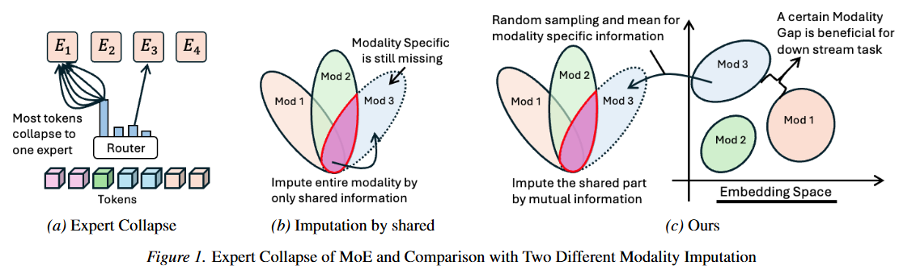
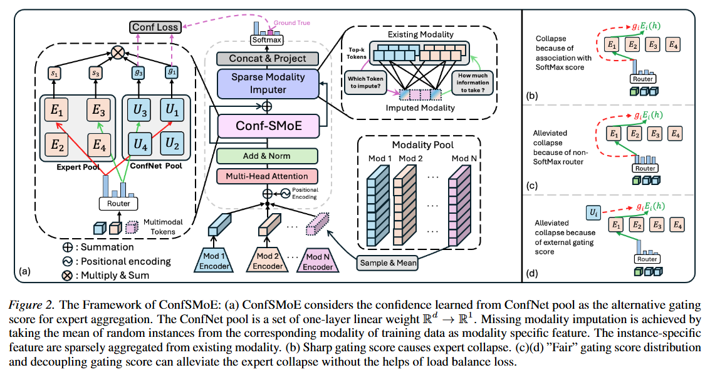

# [ICML 2026] Official Repository of ConfSMoE: Handling Missing and Multi-Modal Inputs with Confidence-Guided Sparse Expert Selection

Authors: [Liangwei Nathan Zheng](https://scholar.google.com/citations?user=zgZlJT4AAAAJ&hl=en) (liangwei.zheng@adelaide.edu.au), [Wei Emma Zhang](https://scholar.google.com/citations?user=NFzUTiEAAAAJ&hl=en) (wei.e.zhang@adelaide.edu.au), [Mingyu Guo](https://scholar.google.com/citations?user=bxEKdzkAAAAJ&hl=en) (mingyu.guo@adelaide.edu.au), [Olaf Maennel](https://scholar.google.com/citations?user=6bw5Ca0AAAAJ&hl=en) (olaf.maennel@adelaide.edu.au), [Weitong Chen](https://scholar.google.com/citations?user=A1o9VOIAAAAJ&hl=en) (weitong.chen@adelaide.edu.au)

This repository contains only code and all experiment settings for the reproduced purpose. We proposed ConfSMoE, a two-stage missing modality imputation framework with a novel confidence-guided MoE gating mechanism. We evaluated our proposed method in 4 different multimodal datasets under various experimental settings. The raw datasets used in the experiment need to be retrieved since MIMIC-III and MIMIC-IV require ethical checks for all users. While other datasets MOSI and MOSEI are publicly available and easy to retrieve. We will provide the link in the following section. Please see our paper for details.

# Motivation 

Our primary motivation stems from the fundamental challenge of handling missing modalities in real-world multimodal learning, where data incompleteness is often inevitable due to sensor failures or collection errors. We observed that existing Sparse Mixture-of-Experts (SMoE) architectures, while powerful, suffer from severe performance degradation in these scenarios because their routing mechanisms are easily misdirected by unreliable imputed features, leading to a "rich-get-richer" feedback loop known as expert collapse. Through rigorous gradient analysis, we uncovered a critical optimization bottleneck: conventional softmax-based routers combined with auxiliary load-balancing losses create conflicting gradient directions, resulting in an ambiguous expert selection pattern that we call a "Sinusoidal Wave". This conflict prevents the model from achieving true expert specialization. To resolve this, we developed ConfSMoE to introduce a two-stage imputation framework that preserves modality-specific structure and a novel confidence-guided gating mechanism that decouples expert selection from softmax-induced sharpness, thereby ensuring robust, diverse, and interpretable multimodal interaction without the need for additional balancing losses.

# Overall Framework

# Datasets Retrieval
## MIMIC-III 

MIMIC-III is a large scale database that requires all the user to retrieve ethical liscence. We do not provide the MIMIC-III data itself. You must acquire the data yourself from https://mimic.physionet.org/. We thank the author of MIMI-III Benchmark, CnicalNotesICU, and MultimodalMIMIC that offers well-orgnized preprocessing scripts. Firstly, you need to retrieve raw data of MIMIC-III containing many .csv files to extract irregular time series modality. Secondly, run scripts offer by ClinicalNotesICU to extract clinical notes modality. Thirdly, run preprocess.py offered by MultimodalMIMIC to match the patients. Next, you should be able to obtain trainp2x_daata.pkl and testp2x_daata.pkl. Place them into ./data/MIMIC-III/.

## MIMIC-IV 

I am organizing the code for the dataset preprocess.... it is very similar to MIMIC-III 

## MOSI & MOSEI 

Please download the processed aligned MOSI and MOSEI dataset from [MultiBench](https://github.com/pliang279/MultiBench). We use the aligned and well-processed version of datasets named as `mosi_data.pkl` `mosei_senti_data.pkl`

# Run Scripts

We have provided all ready-to-run scripts in `scripts` directory onece the dataset files are downloaded. All you need to do is to replace the `datapath` argument in `main.py` with the directory to the dataset.

